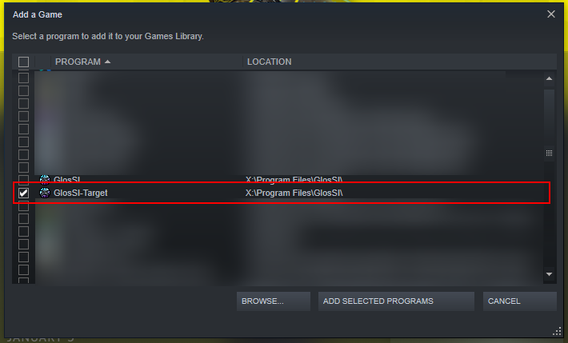

# Solving Incorrect Mappings

The mappings available in each version of Controllable are those that were available at the time of release. This means that a version of Controllable that was released a year ago will have outdated mappings compared to a version that was released a week ago. This can be a problem for new controllers since their mappings won't be present in older versions of Controllable.

You can however solve this issue by manually patching the mappings.

#### Download the Latest Mappings

Head to the [SDL Game Controller Database](https://github.com/gabomdq/SDL\_GameControllerDB) and download the source code.&#x20;

<figure><figcaption></figcaption></figure>

Extract the ZIP into an empty directory. You can delete this directory after you have finished this guide.

#### Patching the Mappings

Locate the JAR file of Controllable you have installed for your game. JAR files are actually just ZIP files with a renamed extension. Next you'll need to open the file as a ZIP archive, and there are few ways to do this.

* In Windows Explorer, change the `.jar` extension to `.zip` then simply double click the file.
* If you have 7Zip installed, simply right click the file and select `7Zip > Open archive`&#x20;

<figure><figcaption>
Controllable jar opened as a ZIP archive.
</figcaption></figure>

You should notice a file called `gamecontrollerdb.txt` in the root directory. This is the file we are going to replace.

Next, open the directory where you extracted the ZIP from earlier. You'll notice the same `gamecontrollerdb.txt` named file. Simply drag that file into opened ZIP archive of Controllable. After it's been copied, make sure you close the window.

If you changed the extension to `.zip` you will need to change it back to `.jar` for it to work correctly again.

You can now start your game!


If you still have problems after updating your mappings, consider a different method of [connecting your gamepad](../guides/how-to-connect-a-gamepad/). You should also go through the troubleshooting [Checklist](checklist.md).


